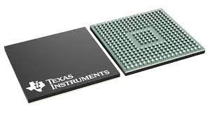
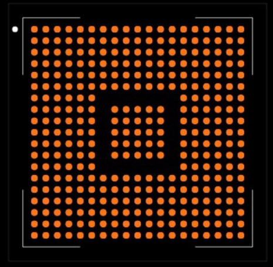
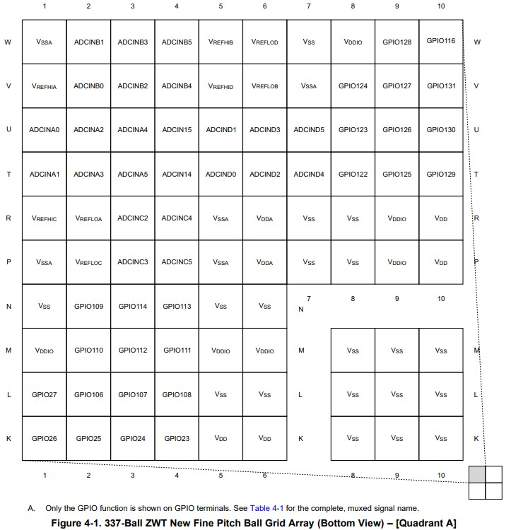
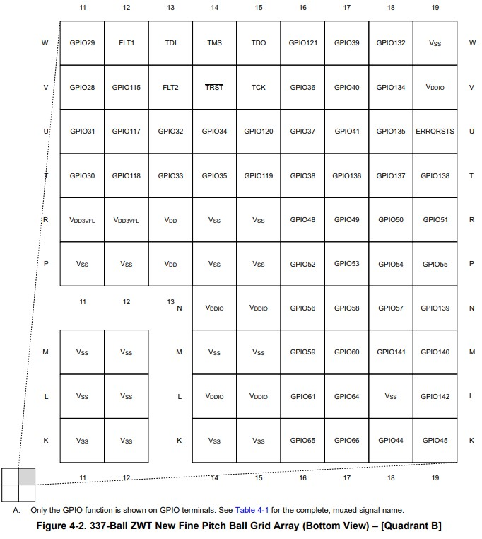
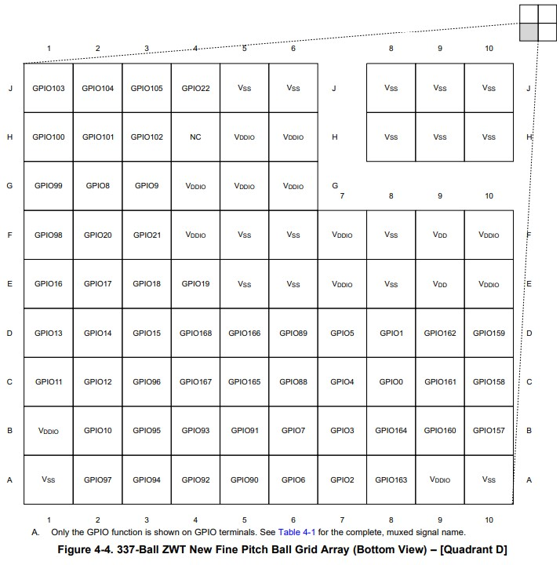
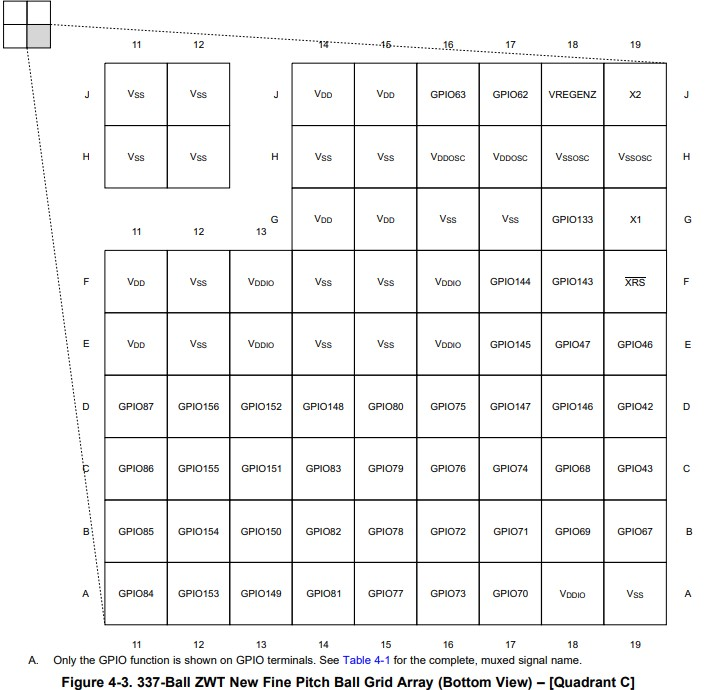
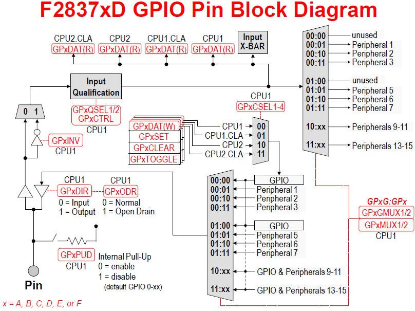
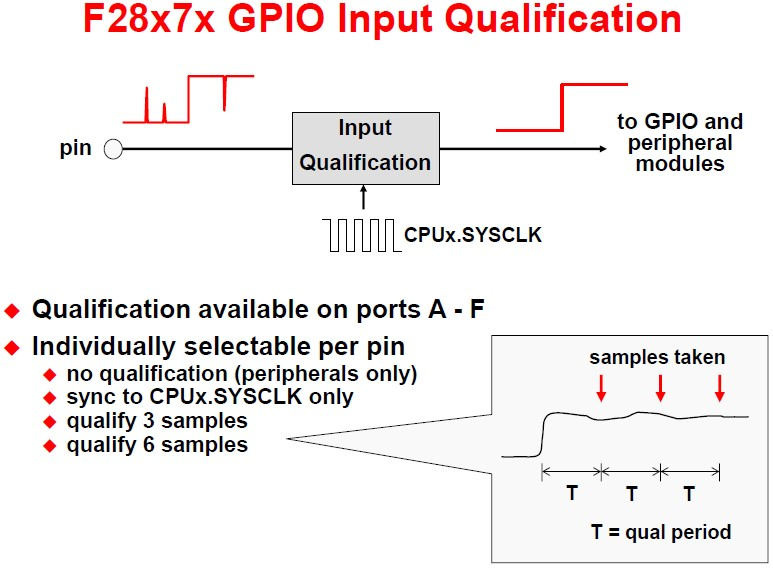
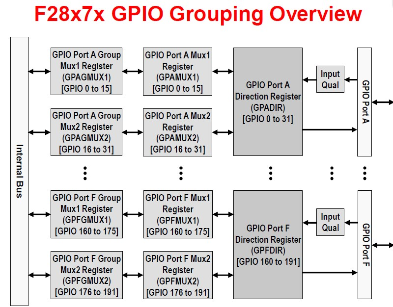

Here I explain the GPIO function. First a general pinout, then how to enable a specific pinout.

# External pinout

The LAUNCHXL-F28379D uses a TMS320F28379DZWTT pinout, the ZWTT means it is a BGA pinout. Below shows how the chip looks like


Physical chip             |  CAD pinout
:-------------------------:|:-------------------------:
  |  

For those interested these are the pinouts. 

 Left                                             |  Right
:-------------------------:                       |:-------------------------:
  |  
 |  

Each GPIO pin could have different application depending on which multiplexer is used. For detailed explanation look at 
[Table 4-1. Signal Descriptions, Page 20-41](https://github.com/HDialani/TMS320F28379D_Coding/blob/main/Resources/tms320f28379d_datasheet.pdf)

# GPIO setup

Now to the software side. Below show the F2837xD GPIO Pin Block Diagram. Yes I know it looks scary, but I will to explain it. 
<p align="center">
 
</p>
For those interested you can read TI's explation here 
[Page 99](https://github.com/HDialani/TMS320F28379D_Coding/blob/main/Resources/WorkshopManual.pdf)


- First is the GPxPUD. This is to enable (GPxPUD=0;) or disable (GPxPUD=1;) the internal pull-up resistor. For those not familiar with digital electronics design the pull-up resistor need the resistor for current limiting when states change and
to make sure that there is no floating state. For more detailed explanation [read this](https://circuitdigest.com/tutorial/pull-up-and-pull-down-resistor).
 
- Next is GPxDIR. 
This sets the direction of the GPIO. GPxDIR=1; means output GPIO and GPxDIR=0; means input GPIO

- Next is GPxODR. 
it sets up the configuration. Normal aka Push-Pull(Totem Pole) or Open drain. Normal mode is commonly used since it switches faster and uses less power. Open drain is prefered for multi-device connection.
If interested read [1](https://cotorelay.com/wp-content/uploads/2019/12/Push-Pull-vs.-Open-Drain-Output-How-to-Choose.pdf), [2](https://open4tech.com/open-drain-output-vs-push-pull-output/), [3](https://electronics.stackexchange.com/questions/620150/difference-between-open-drain-and-push-pull-modes)
  
- Next is GPxINV. 
It select if you want an inverted signal GPxINV=1; or non-inverted signal GPxINV=0; This saves adding an inverter. 


- Next is GPxCTRL and GPxQSEL1/2. 
These effect the input qualification. Input qualification is usefull in remove noises from measurements. It does this by takin samples. Look at the figure below

<p align="center">
 
<p>

- GPxCTRL sets sampling period and GPxQSEL1/2 selects which registers(Will explain register selection in next part)

- GPxCSEL1-4 lets you select which core is being used. The options are CPU1.CLA can run in parallel to CPU1. Same with CPU2.CLA. 

- Finally are the GPxGMUX1/2 and GPxMUX1/2. These will be explained in GPIO selection. GPxDAT(R) is a setting parameter which will also be explained in GPIO selection

# GPIO selection

This micro controller has 337 pins, but not all can be used some are POWER and GND. This leaves 192 pins over. Sadly I am using the Lauchpad and not the Controlcard so I have even less pins over <80. Below shows the how the 192 pins are dived 

<p align="center">
 
<p>

<div align="center">

| GPIO number   | Port letter   | MUX |
| ------------- |:-------------:| -----:|
| GPIO 0-15     | A             | MUX1 |
| GPIO 16-31    | A             | MUX2 |
| GPIO 32-47    | B             | MUX1 |
| GPIO 48-63    | B             | MUX2 |
| GPIO 64-79    | C             | MUX1 |
| GPIO 80-95    | C             | MUX2 |
| GPIO 96-111   | D             | MUX1 |
| GPIO 112-127  | D             | MUX2 |
| GPIO 128-143  | E             | MUX1 |
| GPIO 144-159  | E             | MUX2 |
| GPIO 160-175  | F             | MUX1 |
| GPIO 176-191  | F             | MUX2 |

</div>

# Software

The first step is to enable a GPIO. I will pick GPIO34 as an example


```C
    EALLOW;
    GpioCtrlRegs.GPADIR.bit.GPIO31 = 1;
    GPIO_SetupPinOptions(34, GPIO_OUTPUT, GPIO_PUSHPULL);
    GPIO_SetupPinMux(34, GPIO_MUX_CPU2, 0);
//
// TODO Add code to allow configuration of GPADIR from CPU02 using IPC
//
    EDIS;
    GpioDataRegs.GPADAT.bit.GPIO31 = 1;// turn off LED

```
